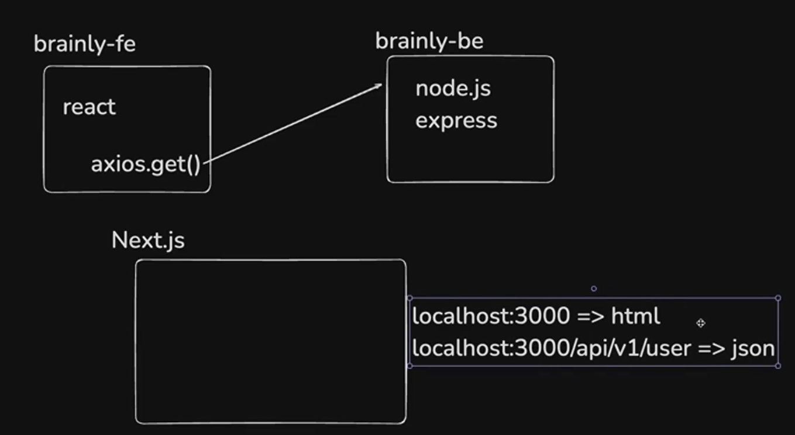
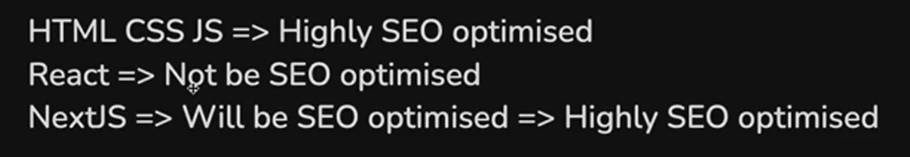
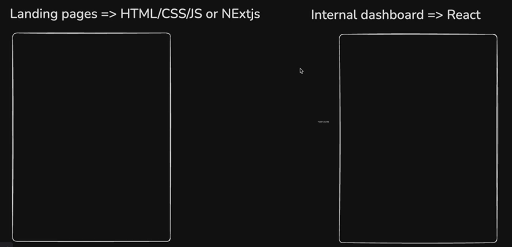
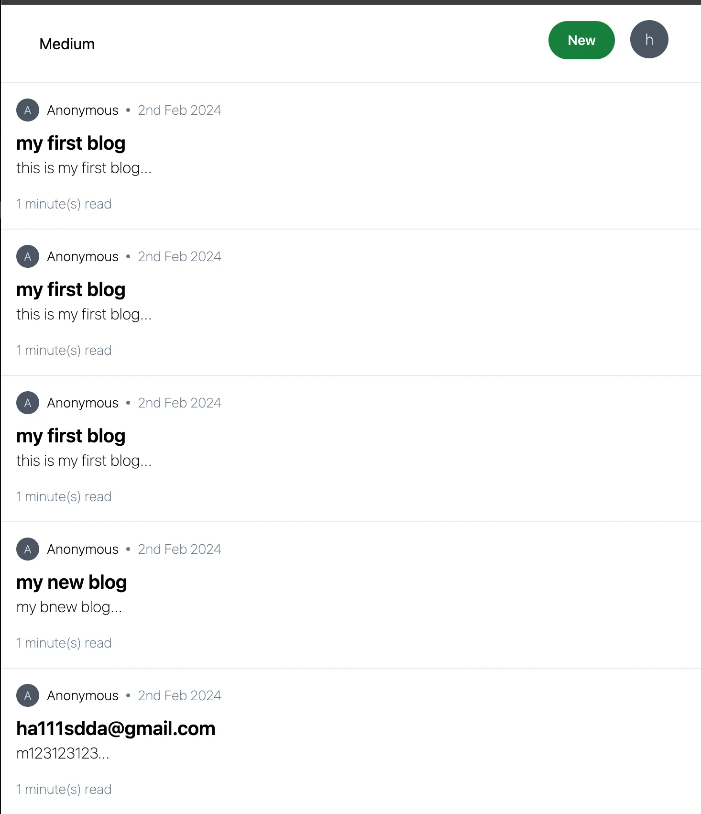
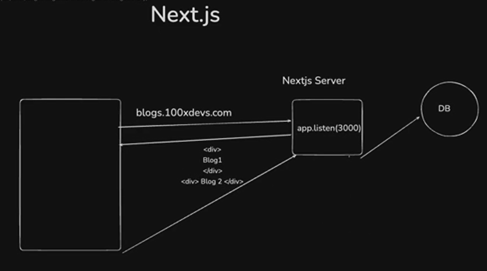
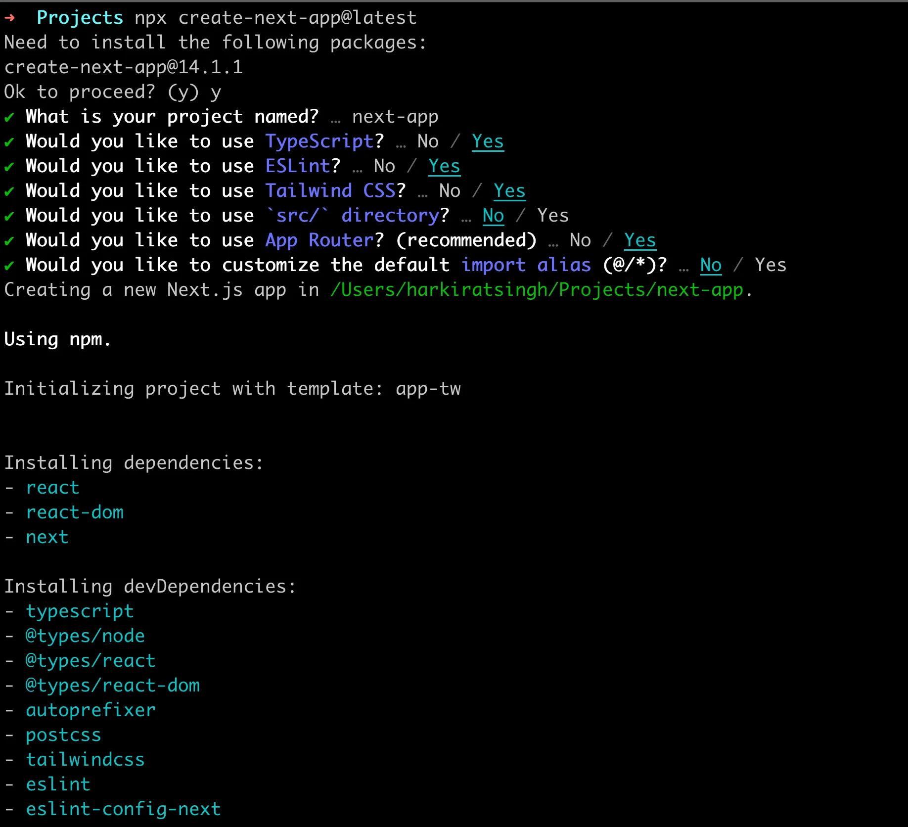
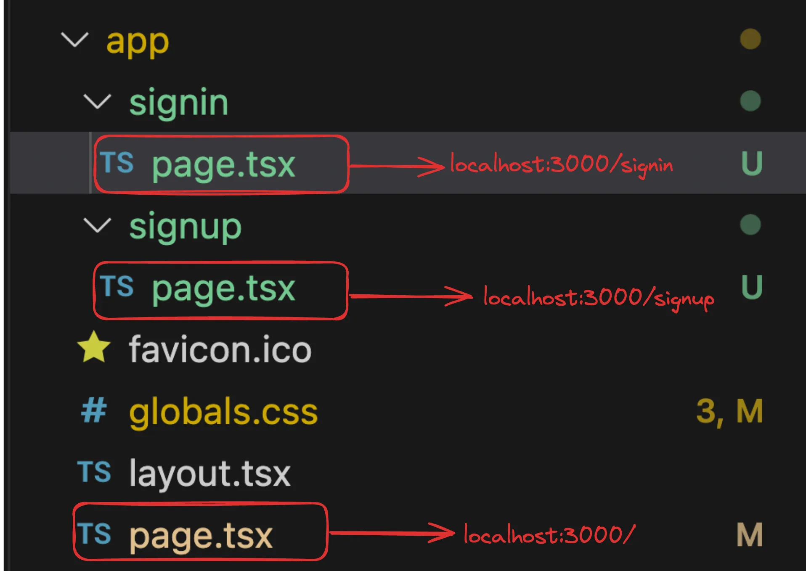
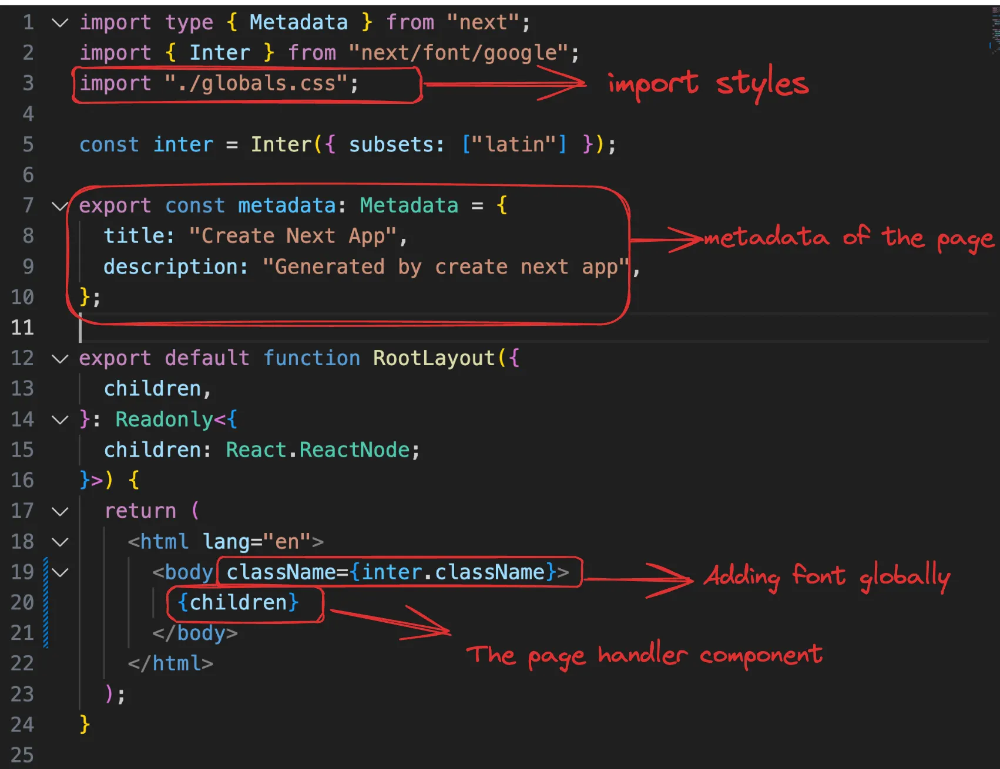
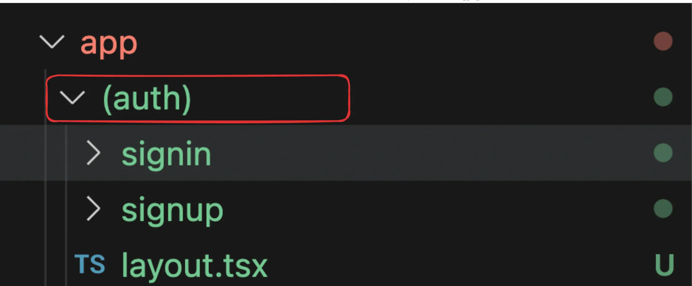

# NextJS
## Step 1 - NextJS Intro, Pre-requisites
### Pre-requisites
- You need to understand basic Frontend before proceeding to this track.
- You need to know what `React` is and how you can create a simple application in it

### NextJS Intro
- NextJS was a framework that was introduced because of some `minor inconviniences` in React.
- Scalable Project highlights the inconviniences.
- Remix can also be used as an alternative to the NextJS.

#### 1. Seperate Backend required in ReactJS
- In a React project, you have to maintain a separate Backend project for your `API routes`, `NextJS does not use the ExpressJS`, they have their implementation of their own.
- In NextJS we can return HTML, JSON etc. unlike React we need NodeJS to return JSON, XML etc.




#### 2. ReactJS does not provide out of the box routing
- We have to use react-router-dom for routing.


- `React` is only the diffing engine, it only checks that the DOM has changed and it tells the React Router DOM about the changes.

- `React Router DOM` implements the changes in the DOM, and it is used to create the web applications.

- `React Native` implements the changes in the DOM, and it is used to create the mobile applications.

- Routing is done explicitly be the react-router- dom. We need 3 libraries to build the application in react.

#### 3. React is not SEO Optimised(REAL BENEFIT of NextJS).


1. Not exactly true today because of React Server components.

2. We’ll discuss soon why.
   - Due to this Website's `landing page` is in the `HTML/CSS/JS`.
   - The `Internal Dashboard` is in `ReactJS`.



- Example - Neon for the PostgreSQL.

#### 4. Waterfalling problem.
- This is the reason for which the React does not do the SEO Optimization.

---

## Step 2 - SEO Optimisation
- Google/Bing has a bunch of `crawlers` that hit websites and figure out what the website does.

- It ranks it on `Google` based on the HTML it gets back, it can be seen in the Network Tab when the website is rendered what it gets.

- The crawlers `DONT` usually run your JS and render your page to see the final output.


```text
💡 While Googlebot can run JavaScript, dynamically generated content is harder for the scraper to index
```

### Try visiting a react website
- What does the `Googlebot` get back when they visit a website written in react?

- Try visiting [React Website](https://blog-six-tan-47.vercel.app/signup)


- Googlebot has no idea on what the project is, when the landing page is built in ReactJS.

- It only sees `Vite + React + TS` in the original HTML response, when the landing page is built in ReactJS.

- Ofcourse when the JS file loads eventually, things get rendered but the `Googlebot` doesn’t discover this content very well.

---

## Step 3 - Waterfalling problem
- Let’s say you built a blogging website in react, what steps do you think the `request cycle` takes?




1. Fetching the index.html from the CDN.
2. Fetching script.js from CDN.
3. Checking if user is logged in (if not, redirect them to /login page).
4. Fetching the actual blogs.

- There are 4 round trips that happen one after the other (sequentially).

```text
 💡The "waterfalling problem" in ReactJS, and more broadly in web development, refers to a scenario where data fetching operations are chained or dependent on each other in a way that leads to inefficient loading behavior.
```

### What does Nextjs provide you?


## Step 4 - Next.js offerings
- Next.js provides you the following upsides over React:
### 1. `Server side rendering` - Get’s rid of SEO problems.
- In ReactJS application, browser hits the Frontend Server to get the HTML and JS files.
- Then the JS file call the Backend APIs which is running on the Express Server.
- ReactJS tells the React Router DOM to make changes on the UI.
- In NextJS application the browser hits the NextJS server and it calls the Backend server to get the HTML, JSON etc.


### 2. `API routes`
- NextJS has a Single codebase with Frontend and Backend.
- In the ReactJS Project if we run the `npm run build` and delete the entire project except for the `dist/` which has the bundle we can run the project using `npx serve`.
- React Project at the end builds the `HTML/CSS/JS` Files.
- The Frontend and Backend can be in the same application in the NextJS.
- The Frontend application can also talk to the server in the NextJS application.
- The Backend route can also be created in the NextJS application.

### 3. `File based routing` (no need for react-router-dom).
- The file structure allows the routing.

### 4. `Bundle size optimisations and Static site generation`
- We cannot pick and choose what we get from the server and what we do not get from the server in ReactJS.
- We get to pick and choose in the NextJS what we want and what we don't want from the server.

### 5. `Maintained by the Vercel team`


### Downsides -
1. NextJS can’t be distributed via a CDN, always needs a server running that does server side rendering and hence is expensive. ReactJS on the other hand is very cheap can be deployed without a server.

2. Very hard to move out of NextJS, once we create NextJS application it is very hard to move it to a different technology like ReactJS or other.



## Step 5 - Let's bootstrap a simple Next app
- To create a fresh NextJS application:
```bash
   npx create-next-app@latest
```



### File structure


1. next.config.mjs - Nextjs configuration file
2. tailwind.config.js - Tailwind configuration file
3. app - Contains all your code/components/layouts/routes/apis

### Bootstrap the project
1. Remove everything from `app/page.tsx` and return an empty div.
2. Remove the css bits (not the tailwind headers) from the `global.css` file.

- To run the application
```bash
    npm run dev
```

## Step 6 - Understanding routing in Next

### Routing in React
- Reference to the Website [Reference](https://blog-six-tan-47.verc)


### Routing in Next.js
- Next.js has a file based router [Defining routes](https://nextjs.org/docs/app/building-your-application/routing/defining-routes).
- This means that the way you create your files, describes what renders on a route.

### Final folder structure


### Assignment - Can you add a signin route?


## Step 7 - Prettify the signin page
- Let’s replace the signup page with a prettier one

```tsx
export default function Signin() {
    return <div className="h-screen flex justify-center flex-col">
        <div className="flex justify-center">
        <a href="#" className="block max-w-sm p-6 bg-white border border-gray-200 rounded-lg shadow hover:bg-gray-100 ">
                <div>
                    <div className="px-10">
                        <div className="text-3xl font-extrabold">
                            Sign in
                        </div>
                    </div>
                    <div className="pt-2">
                        <LabelledInput label="Username" placeholder="harkirat@gmail.com" />
                        <LabelledInput label="Password" type={"password"} placeholder="123456" />
                        <button type="button" className="mt-8 w-full text-white bg-gray-800 focus:ring-4 focus:ring-gray-300 font-medium rounded-lg text-sm px-5 py-2.5 me-2 mb-2">Sign in</button>
                    </div>
                </div>
            </a>
        </div>
    </div>
}

interface LabelledInputType {
    label: string;
    placeholder: string;
    type?: string;
}

function LabelledInput({ label, placeholder, type }: LabelledInputType) {
    return <div>
        <label className="block mb-2 text-sm text-black font-semibold pt-4">{label}</label>
        <input type={type || "text"} id="first_name" className="bg-gray-50 border border-gray-300 text-gray-900 text-sm rounded-lg focus:ring-blue-500 focus:border-blue-500 block w-full p-2.5" placeholder={placeholder} required />
    </div>
}
```

## Step 8 - Server side rendering
- Let’s try exploring the response from the server on the /signup route

### 1. Run 
```bash
    npm run dev
```

### 2. Visit [Sign Up Page](http://localhost:3000/signup)

### 3. Notice the response you get back in your HTML file.


- Now if `GoogleBot` tries to scrape your page, it’ll understand that this is a `signup page` without running any Javascript.

- The first `index.html` file it get’s back will have context about the page since it was `server side rendered`.

- Now we will be creating a blog page in the blogs route.

- If in the NextJS application we are writing the code like ReactJS then we will not get the benifits of the Server Side Rendering.

- Like if we are using the useEffect() hook, it will be proper client side code.

## Children Prop in React
- In React, children is a special prop that represents whatever is placed between the opening and closing tags of a component.

```ts
export default function Component(){
    return (
        <div>
            /* Button Component 
             * Sign Up Button is a children prop
             * Sign In Button is also a children prop
             */
            <Button>Sign Up Button</Button>
            <Button>Sign In Button</Button>
        </div>
    )
}

/* The Button component accepts {children} as a prop using destructuring */
function Button({children}){
    return (
        <button>
            { children }
        </button>
    )
}

```

## Step 9 - Layout
- You’ll notice a file in your `app` folder called `layout.tsx`
- Let’s see what this does [Ref](https://nextjs.org/docs/app/building-your-application/routing/pages-and-layouts).


### What are layouts?
- Layouts let you `wrap` all child `pages` inside some logic.
- Let’s explore `layout.tsx`.



### Assignment
- Try adding a simple `Appbar`.


## Step 10 - Layouts in sub routes
- What if you want all routes that start with `/signin` to have a `banner` that says `Login now to get 20% off`.


## Step 11 - Merging routes
### Approach #1
- Move both the signin and signup folder inside a auth folder where we have the layout.


- You can access the routes at [Sign Up](http://localhost:3000/auth/signup) and [Sign In](http://localhost:3000/auth/signin)


### Approach #2
- You can use create a new folder with `()` around the name. 
- This folder is `ignored` by the router.



- You can access the routes at [Sign Up](http://localhost:3000/signup) and [Sign In](http://localhost:3000/signin)


